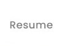
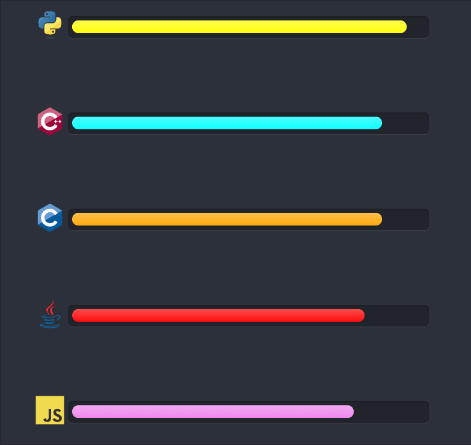

<h1 align="right">
  
  
  
  
  
  
  <!--  
  
  
  
  
   -->
</h1>

<h1 align="right">
  
</h1>

  I am graduate student at State University of New York, Binghamton. I love problem-solving and I thrive for continuous improvement. I like to lead people and explore new/unfamiliar technology. I have a strong analytical background with expertise in data science and machine learning.  
  In my past, I have worked with a variety of technologies majorly related to data and database. I have experience in backend production servers(maintenance and scalability of both relational & non-relational databases), manipulating large data and algorithm optimizations. I also have experience in data modelling and data visualization for small scale industries.  
  With passion for algorithms and data, I am actively looking for opportunities in Software Development and/or Data Science. 

  

  

 
  

<h3 align="left">Languages:</h3>

<h3 align="left">Tools:</h3>

  
  
  </li>
  
  
  
  
  
  
  
  
  
  
  
  
  
  
  
  
  
  
  
  
  
  
  
  
  
  
  
  
  
  
  
  
  
  

<!-- adding this line for commit -->

<h2>Education</h2>
<h4 align="left"> Binghamton University, SUNY | Watson School of Engineering and Applied Science &emsp;&emsp;&emsp;&emsp;&emsp;&emsp;&emsp;&emsp;&emsp;&emsp;&emsp;&emsp; Expected May 2021</h3>
Master of Science in Computer Science &emsp;&emsp;&emsp;&emsp;&emsp;&emsp;&emsp;&emsp;&emsp;&emsp;&emsp;&emsp;&emsp;&emsp;&emsp;&emsp;&emsp;&emsp;&emsp;&emsp;&emsp;&emsp;&emsp;&emsp; &emsp;&emsp;&emsp;&emsp;&emsp;&emsp;&emsp;&emsp;&emsp;&emsp;&emsp;&emsp;&emsp;&ensp; 3.38/4.00

<h4 align="left"> Savitribai Phule Pune University, India &emsp;&emsp;&emsp;&emsp;&emsp;&emsp;&emsp;&emsp;&emsp;&emsp;&emsp;&emsp;&emsp;&emsp;&emsp;&emsp;&emsp;&emsp;&emsp;&emsp;&emsp;&emsp;&emsp;&emsp; &emsp;&emsp;&emsp;&emsp;&emsp;&emsp;&emsp; June 2014 – May 2018</h3>
Bachelor of Engineering in Computer | Best Outgoing Student - 2018, Best All-Round Performance - 2017&emsp;&emsp;&emsp;&emsp;&emsp;&emsp;&emsp;&emsp;&ensp;3.28/4.00

<h2>Publications</h2>
  • Sign Language Reader for Deaf and Mute using Supervised Machine Learning [Patent App. No. 201721027128]  
  • Artificially Intelligent Temperature Monitoring System for Prudent Brooding [Research Paper ID ISSN2229-5518 I0123274]  
  • A Brief Survey of Finance Management [Survey Paper ID ISSN2229-5518 - I0118772]  

<h2> Languages </h2>
  

<h2>Skills</h2>
<h4> Analytics </h4>
  &nbsp;&nbsp;&nbsp;&nbsp;• Apache Mahout &emsp;&emsp;&emsp;• Apache Spark &emsp;&emsp;&emsp;&emsp;&emsp;&ensp;• Google Analytics &emsp;&emsp;&emsp;• Google Cloud ML Engine  
  &nbsp;&nbsp;&nbsp;&nbsp;• Microsoft Azure &emsp;&emsp;&emsp;• Microsoft Power BI &emsp;&emsp;&emsp;• Tableau &emsp;&emsp;&emsp;&emsp;&emsp;&emsp;&emsp;• SAS  

<h4> Tools </h4>
  &nbsp;&nbsp;&nbsp;&nbsp;• Amazon Web Services (AWS) &emsp;&emsp;&emsp;• Hadoop &emsp;&emsp;&emsp;• Hive &emsp;&emsp;&emsp;&emsp;&emsp;&emsp;&emsp;&ensp;• MongoDB &emsp;&emsp;&emsp;• Matlab &emsp;&emsp;&emsp;• React  
  &nbsp;&nbsp;&nbsp;&nbsp;• Android &emsp;&emsp;&emsp;&emsp;• Cucumber &emsp;&emsp;&ensp;• Docker &emsp;&emsp;&emsp;&ensp;• Kubernetes &emsp;&emsp;&emsp;&emsp;&ensp;• VMWare&emsp;&emsp;&emsp;&emsp;• Vim   
  &nbsp;&nbsp;&nbsp;&nbsp;• Anaconda &emsp;&emsp;&emsp;• GDB&emsp;&emsp;&emsp;&emsp;&emsp;&ensp;• MS Office &emsp;&emsp; • MS Visual Studio &emsp;&emsp;• Linux/Unix &emsp;&emsp;&emsp;• Git  

<h4> Frameworks </h4>
  &nbsp;&nbsp;&nbsp;&nbsp;• Angular &emsp;&emsp;&emsp;&emsp;&emsp;&emsp;• Django &emsp;&emsp;&emsp;&emsp;&emsp;&emsp;&emsp;&ensp; • Flask &emsp;&emsp;&emsp;&emsp;&ensp;&emsp;&emsp;&emsp;• JQuery &emsp;&emsp;&emsp;&emsp;&emsp;&emsp;&ensp; • Octave 
  &nbsp;&nbsp;&nbsp;&nbsp;• QT &emsp;&emsp;&emsp;&emsp;&emsp;&emsp;&emsp;&emsp; • Ruby on Rails &emsp;&emsp;&emsp;&emsp;&emsp;• Tkinter &emsp;&emsp;&emsp;&emsp;&ensp;&emsp;&emsp;• TensorFlow &emsp;&emsp;&emsp;&emsp;&emsp;• WordPress 

<h4> Machine Learning </h4>
  &nbsp;&nbsp;&nbsp;&nbsp;• 
Inception V3 &emsp;&emsp;&emsp;&emsp;&emsp;&emsp;• Kera’s API &emsp;&emsp;&emsp;&emsp;&emsp;&emsp;&emsp;&ensp; • NumPy &emsp;&emsp;&emsp;&emsp;&ensp;&emsp;&emsp;&emsp;• OpenCV  &emsp;&emsp;&emsp;&emsp;&emsp;&emsp;&emsp;&emsp;• Pandas 
  &nbsp;&nbsp;&nbsp;&nbsp;• PyTorch &emsp;&emsp;&emsp;&emsp;&emsp;&emsp;&emsp;&emsp;• Sci-Kit Learn &emsp;&emsp;&emsp;&emsp;&emsp;&emsp;&ensp;• Theano &emsp;&emsp;&emsp;&emsp;&emsp;&emsp;&emsp;&ensp; • YOLO 
  
<h4> Relevent Courses </h4>
&nbsp;&nbsp;&nbsp;&nbsp;• Design and Analysis of Algorithms &ensp;&emsp;• Data Structures &emsp;&emsp;&emsp;• Data Mining &emsp;&emsp;&emsp;&emsp;&emsp;&emsp; • Design Patterns  
&nbsp;&nbsp;&nbsp;&nbsp;• DataBases &emsp;&emsp;&emsp;&emsp;&emsp;&emsp;&emsp;&emsp;&emsp;&emsp;&emsp;&emsp;• Cyber Security &emsp;&emsp;&emsp;&ensp;• Software Engineering

<h2>EXPERIENCE</h2>

<h2>PROJECTS</h2>

<h2>HONORS & ACHIEVEMENTS </h2>
  • Founder and Leader of robotics team of 300+ members and career-best ranking of 29 out of 170 teams in India  
  • Chair, Association for Computing Machinery (ACM) Students’ Chapter at D. Y. Patil College of Engineering, Pune  
<h6 align="center"> 
  ● <a href="kulonku96@gmail.com">email</a> 
  ● <a href="+1-607-304-0709">+1-607-304-0709 </a> 
  ● <a href="www.linkedin.com/in/onkkul/"> linkedIn </a> 
</h6>
